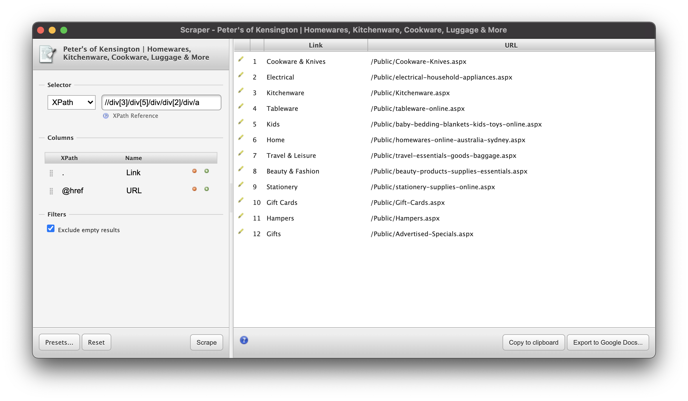
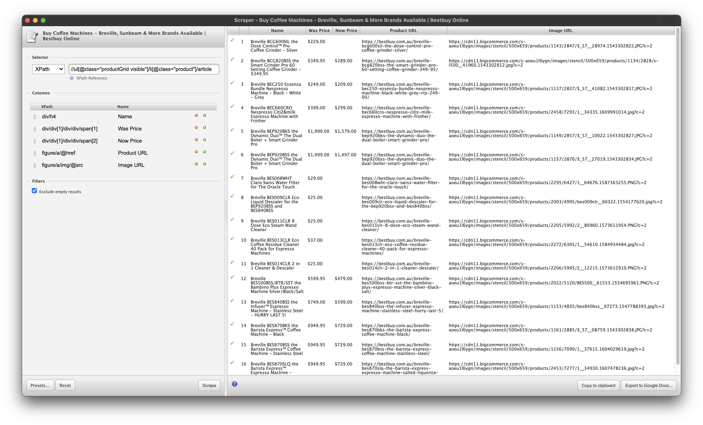
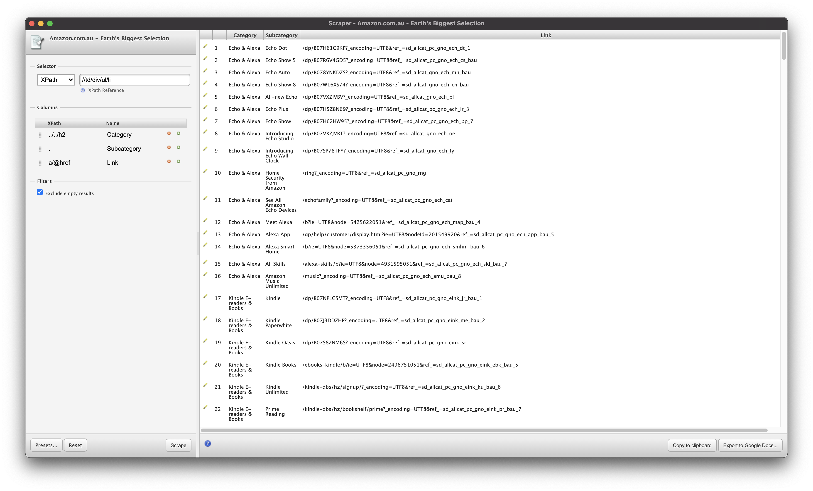

# ShopGrok Internship Challenges

## XPath Tech Test

#### Test 1

#### Test 2

#### Test 3

---

## Python Tech Test

#### Part 1

The web crawler for the first part of the tech challenge is located in the `web_crawler` directory. It loops through the Groceries submenu items from the home page and on each submenu item page it will also navigate any additional subcategories, i.e. it will navigate to the 'Laundry' and 'Household' pages through the 'Laundry & Houshold' page to get product information.

The product data from running the crawler is included in the [data.csv file](web_crawler/data.csv) also inside the `web_crawler` directory.

#### Part 2

The [re_tests.py](re_tests.py) file contains the solutions to all 3 of the re tests.